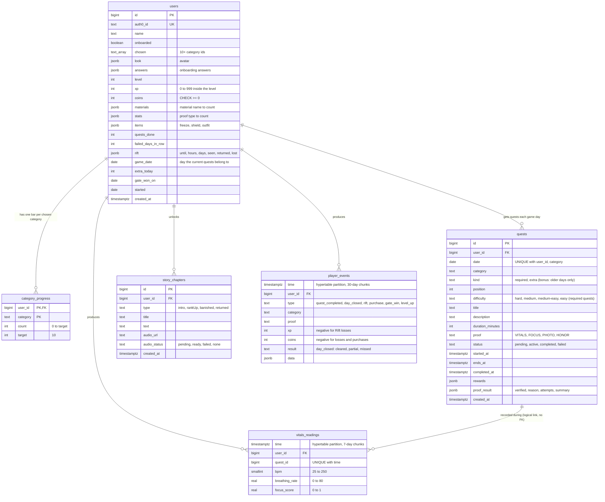
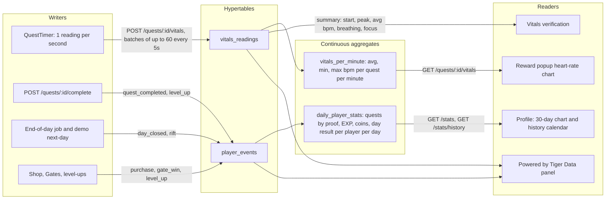
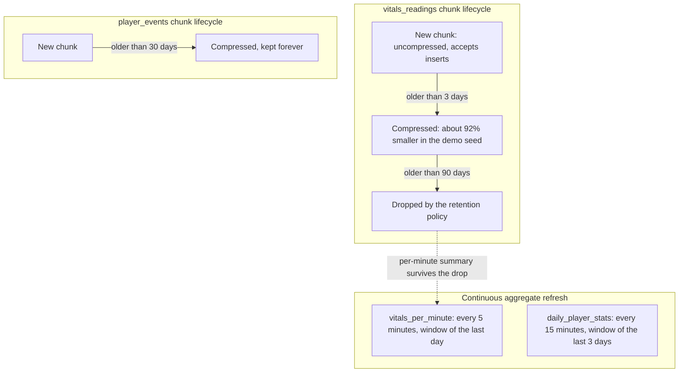

# Database

Level Up stores everything in one Tiger Data service (PostgreSQL + TimescaleDB).
Regular tables hold profiles and game state; two hypertables hold time-series data; two continuous aggregates
summarize them for the charts. Source of truth: [`backend/src/db/schema.sql`](../backend/src/db/schema.sql).

- A **hypertable** is a PostgreSQL table split into time chunks, built for time-series data.
- A **continuous aggregate** is a summary view the database keeps up to date on a schedule.
  Both views here also include the newest raw rows in real time (`materialized_only = false`).

## Entity relationships

All foreign keys use `ON DELETE CASCADE`, so deleting a user removes their quests, bars, chapters, events, and readings.

## Time-series flow

## Background policies

Because `vitals_per_minute` only refreshes the last day, the per-minute history outlives the raw readings.
Never refresh it over a window older than 90 days: that would recompute it from dropped chunks and erase it
(the seed script refreshes only inside the retention window for this reason).

## Storage budget

| Data | Size | Notes |
|---|---|---|
| One heart-rate reading | about 100 bytes raw | including its index |
| Demo seed (85 days of readings) | about 215,000 rows, 29 MB raw, 2.2 MB compressed | measured on TimescaleDB 2.30 |
| 100 players, 30 min of vitals a day, 30 days | about 5.4 million rows, 540 MB raw, about 45 MB compressed | estimate from the seed ratio |
| Free tier | 750 MB | compression plus 90-day retention keeps this comfortable |

## Queries worth knowing

| Question | Where | Reads |
|---|---|---|
| Today's quests | `db/quests.js` `listForDay` | `quests` by `(user_id, date)` |
| Complete a quest | `routes/quests.js` | one transaction: `quests` and `users` `FOR UPDATE`, `category_progress`, `player_events` |
| Close a game day | `game/endOfDay.js` | one transaction per user: `quests`, `player_events`, `users` |
| Verify vitals | `db/vitals.js` `summary` | raw `vitals_readings` for one quest, `time_bucket('10 seconds')` for the peak |
| Reward chart | `db/vitals.js` `perMinute` | `vitals_per_minute` |
| 30-day chart | `db/events.js` `dailyStats` | `daily_player_stats` joined to a `generate_series` of days |
| History calendar | `db/events.js` `history` | `daily_player_stats.day_result` |
| Tiger Data panel | `db/storage.js` | row counts, `hypertable_compression_stats`, timed summary vs raw query |
