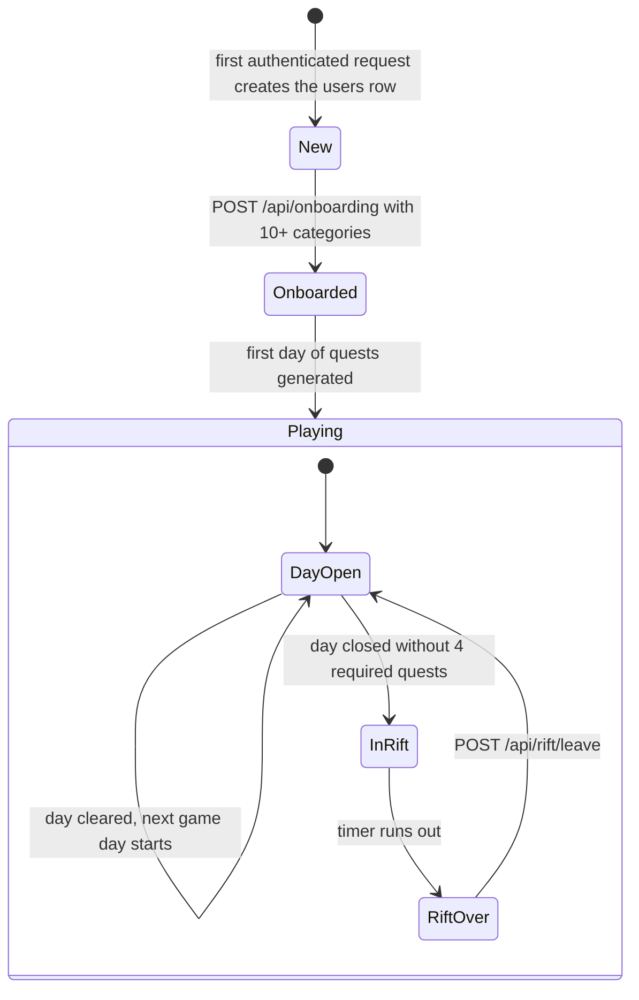
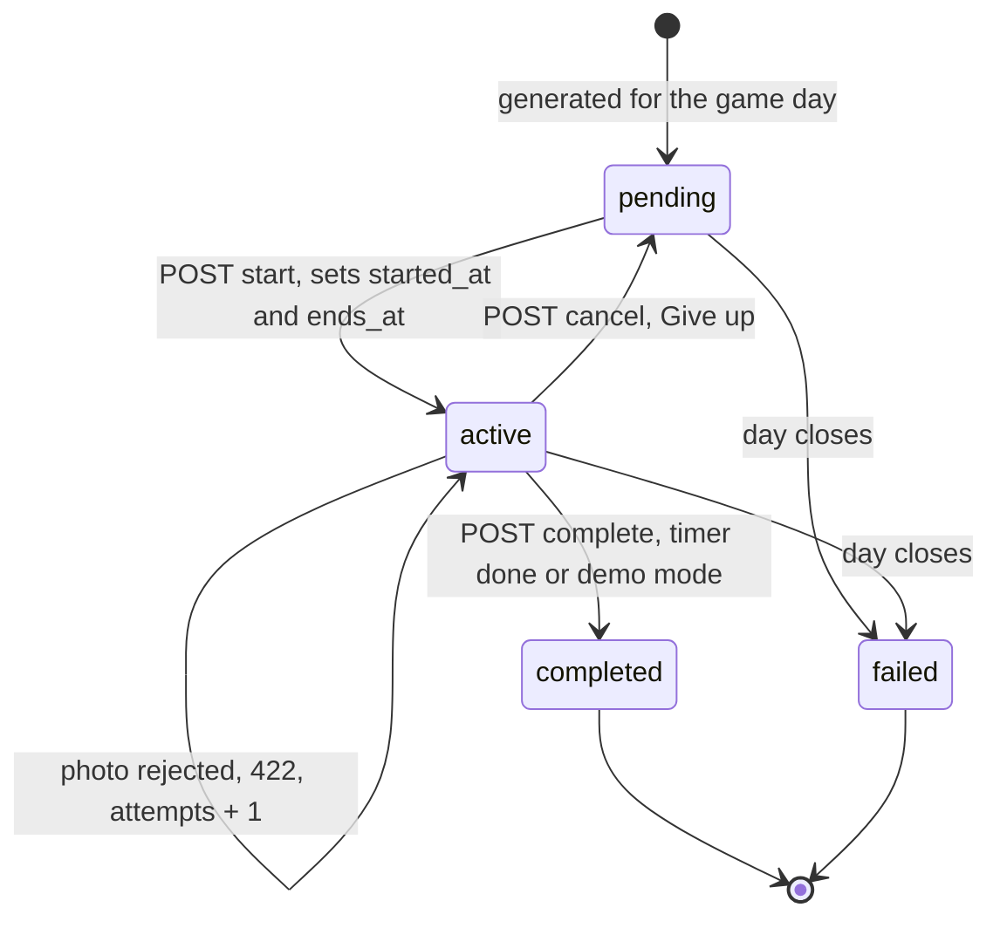
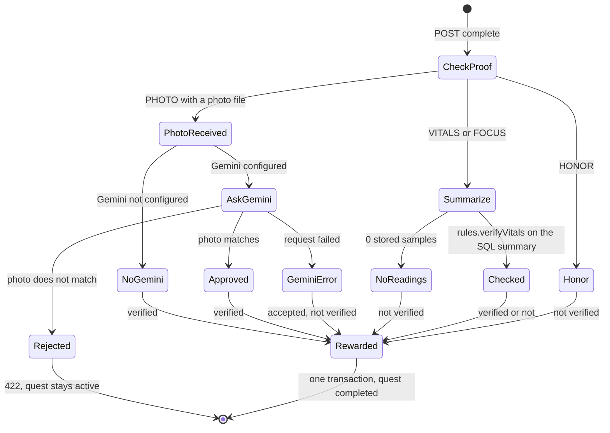
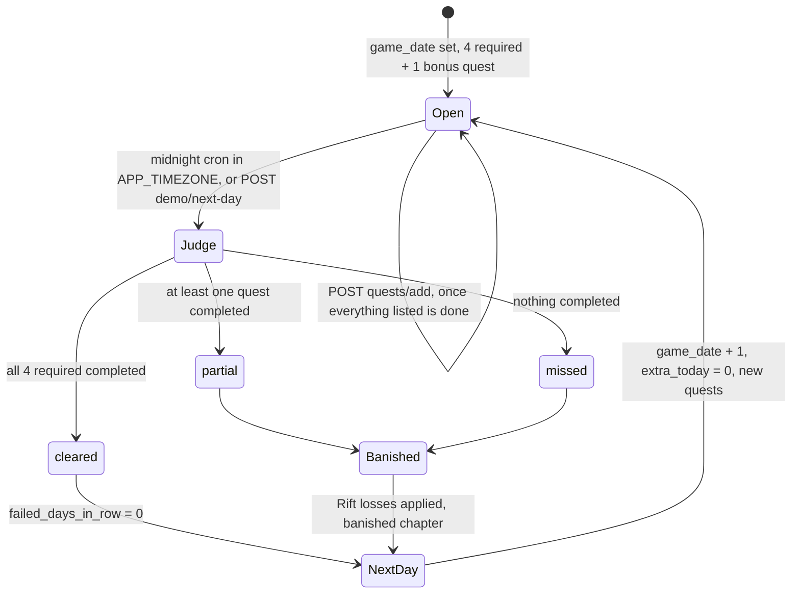
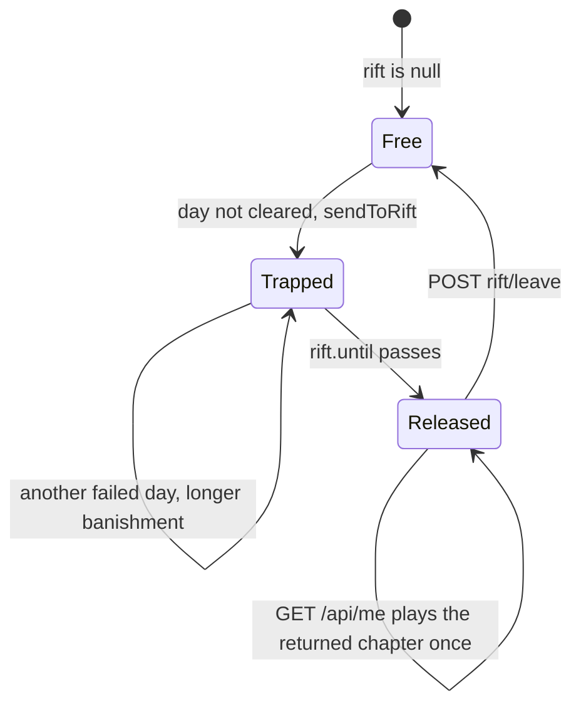
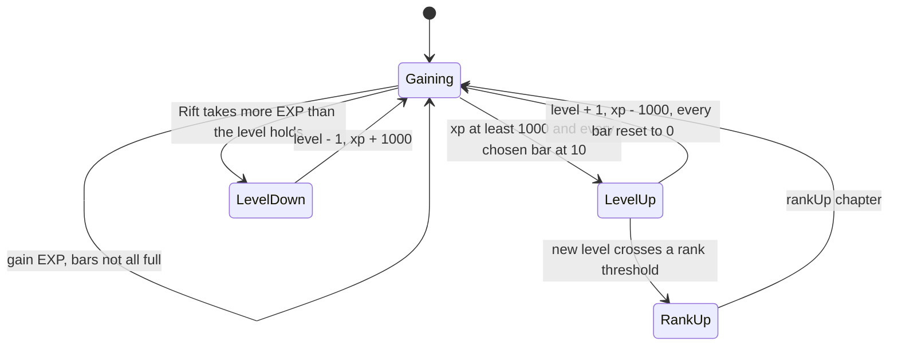
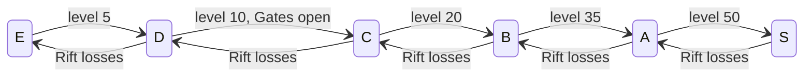
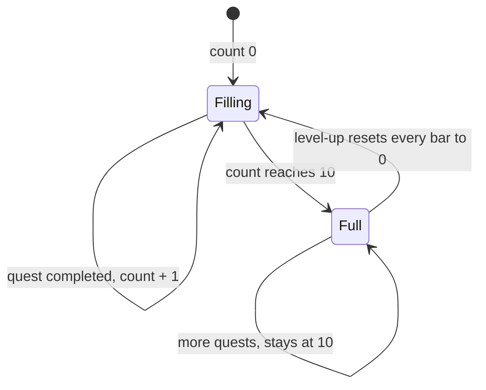
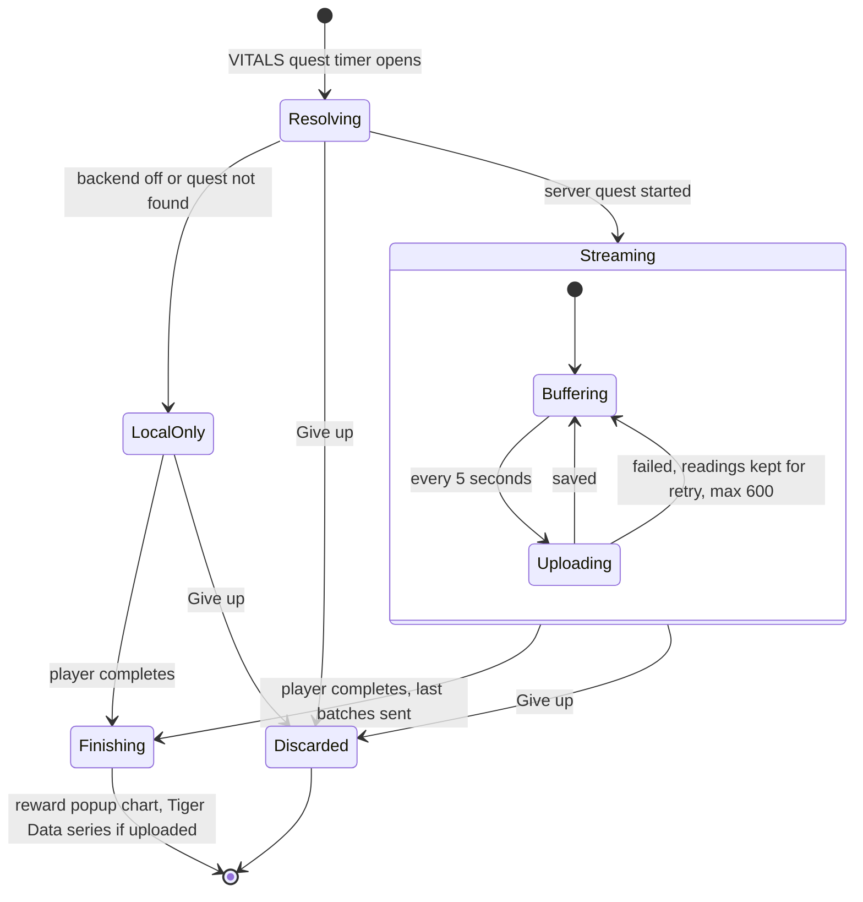
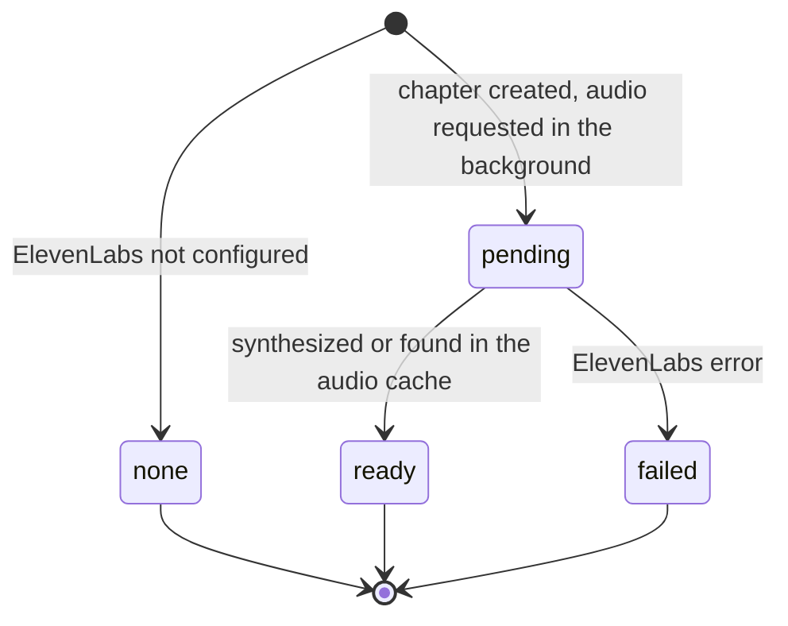

# State machines

How each piece of game state moves, and which route or job moves it. Rules live in
[`backend/src/game/rules.js`](../backend/src/game/rules.js); transitions happen in the routes and in
[`backend/src/game/endOfDay.js`](../backend/src/game/endOfDay.js).

## Player lifecycle

`New` players can only call `/api/me`, `/api/onboarding`, and `/api/voice`; every other route answers `409 Finish onboarding first`.

## Quest status

- Completing before `ends_at` returns `409` outside demo mode.
- `completed` is final: the completion transaction locks the quest row, so a second request gets `409 Quest already completed`.
- Quests are unique per `(user, date, category)`, so a category never repeats in one day.

## Quest verification by proof type

Verification rules for stored readings:

| Category | Verified when |
|---|---|
| strength, running, cycling | peak 10-second average bpm is at least 15 above the first-minute average |
| yoga | breathing in the last minute is slower than in the first; without breathing data, average bpm below the start |
| FOCUS categories | average focus score is at least 0.7 |

Unverified quests still pay their reward, so a camera hiccup never costs the player their day.

## Game day

Each close runs in one transaction per user: open quests become `failed`, a `day_closed` event is written at noon of that game day, and the user row moves to the next date. If the server was down for several days, the job closes each missed day in order.

## The Rift

- Losses per failed day: 150 EXP (levels can drop, never below level 1) and 25 coins (never below 0).
- Duration: 1 hour for each failed day in a row. A Ward potion (`items.shield`) is used up and cuts it to 30 minutes.
- `POST /api/rift/leave` answers `409 Still trapped` until `rift.until` has passed.

## Level and rank

## Category bar

## Vitals recording on the frontend

## Story chapter audio

The frontend polls `GET /api/story` while a chapter is `pending`.
